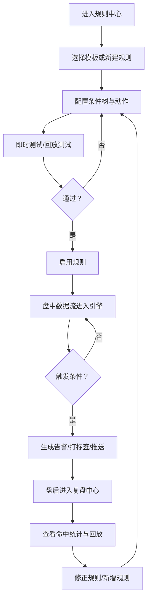

## 1. 产品概述
面向“AI 概念/行业/个股联动 + 预期差/超预期识别”的盘中盯盘与复盘工具，通过可配置的操盘规则引擎自动产出预警与复盘结论。
- 解决问题：减少人工盯盘强度、把个人操盘逻辑结构化沉淀、提高盘中捕捉“异常/超预期”的效率
- 目标用户：长期交易者（概念轮动、情绪周期、梯队交易为主），需要自定义规则并持续迭代

## 2. 核心功能

### 2.1 用户角色
| 角色 | 登录方式 | 核心权限 |
|------|----------|----------|
| 单机用户 | 无需登录 | 本地创建规则、查看看板、查看告警、记录复盘 |

### 2.2 功能模块
1. **盘中看板**：概念/行业热度榜、梯队列表、告警流、个股快照
2. **规则中心**：规则列表、规则新建/编辑、规则测试/回放、规则启停、模板库
3. **复盘中心**：当日复盘报告、告警回放、规则命中统计、交易/操作笔记（MVP 为笔记）

### 2.3 页面详情
| 页面名称 | 模块名称 | 功能描述 |
|----------|----------|----------|
| 盘中看板 | 热度榜 | 展示概念/行业实时强度（涨跌、成交额、涨停家数、炸板率等），支持排序与筛选 |
| 盘中看板 | 梯队视图 | 概念内按“龙头/次核心/补涨/容量/弹性”分层展示个股及关键指标 |
| 盘中看板 | 告警流 | 规则触发的告警聚合展示（分级、去重、可追溯证据） |
| 盘中看板 | 个股快照 | 分时/量能/关键字段快照（MVP 用模拟数据，后续可接真实行情源） |
| 规则中心 | 规则列表 | 查看规则状态、最近命中次数、严重等级、最后触发时间 |
| 规则中心 | 规则编辑器 | 支持“条件树 + 动作”配置；MVP 提供表单化编辑与 JSON 高级编辑两种模式 |
| 规则中心 | 规则测试 | 对当前模拟数据进行即时评估；对历史模拟片段进行回放测试 |
| 规则中心 | 模板库 | 提供“超预期雷达/转强/分歧/退潮”等模板，一键生成并二次编辑 |
| 复盘中心 | 自动复盘 | 当日“主线/分支/情绪相位/关键告警”摘要；MVP 基于规则命中与指标汇总生成 |
| 复盘中心 | 告警回放 | 按时间线回放当日告警与触发条件数据 |
| 复盘中心 | 笔记 | 记录当日判断与计划修正（文本 + 关联概念/个股） |

## 3. 核心流程
核心链路：配置规则 → 测试 → 启用 → 盘中触发告警 → 盘后回放与统计 → 修正规则。

## 4. 用户界面设计

### 4.1 设计风格
- 主题：暗色交易终端风 + 高对比霓虹点缀
- 主色：深墨黑（背景）+ 冷青（信息主色）+ 琥珀黄（风险提示）+ 洋红（超预期高亮）
- 字体：标题使用具有金融编辑感的衬线字体，正文与数字使用等宽字体（强调“终端/表格”可读性）
- 布局：密度可控的三栏布局；列表优先、图表点到为止；重要告警固定在视线中心区域
- 图标：线性图标，少量符号（↑↓⚡）用于快速辨识，不使用大面积表情

### 4.2 页面设计概览
| 页面名称 | 模块名称 | UI 元素 |
|----------|----------|---------|
| 盘中看板 | 热度榜 | 高密度表格、排序列、强弱颜色编码、悬浮详情、键盘快捷聚焦 |
| 盘中看板 | 告警流 | 卡片化告警、分级标识、去重折叠、展开显示“证据字段” |
| 规则中心 | 编辑器 | 左侧规则结构（条件树）+ 右侧字段面板；JSON 模式提供语法高亮与校验 |
| 复盘中心 | 报告 | 时间线 + 概念热度变化图（简洁）、命中统计条形图、可导出 Markdown |

### 4.3 响应式
桌面优先；移动端仅提供“告警列表 + 规则启停 + 快速查看”。

