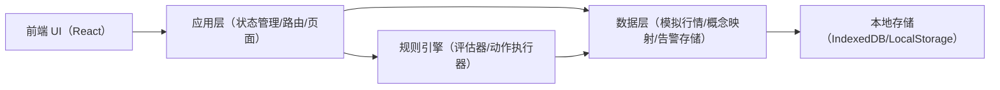
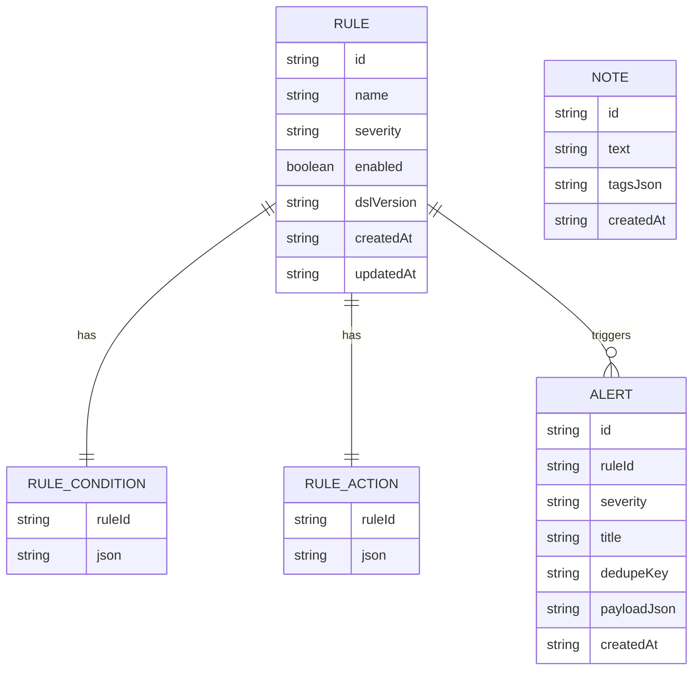

## 1. 架构设计

## 2. 技术说明
- 前端：React@18 + TypeScript + vite
- UI：tailwindcss@3 + 自定义主题变量
- 状态：轻量 store（优先使用现成库；若无则使用 React Context + reducer）
- 数据：MVP 使用本地模拟数据（JSON）；后续可扩展为接入行情/资讯数据源
- 存储：本地浏览器存储（规则、告警、笔记）

## 3. 路由定义
| 路由 | 用途 |
|------|------|
| / | 盘中看板 |
| /rules | 规则中心 |
| /review | 复盘中心 |

## 4. API 定义
MVP 无后端，不提供 HTTP API；所有操作在前端本地完成。

## 5. 数据模型

### 5.1 数据模型定义

### 5.2 字段约定（MVP）
- Rule.severity：INFO / WARN / CRITICAL
- Alert.dedupeKey：用于合并告警（规则 id + 标的/概念 + 时间窗口）
- payloadJson：包含触发时刻的“证据字段”（命中的指标值、上下文快照）

